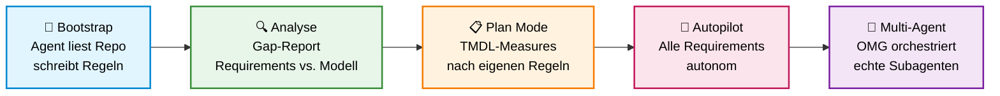
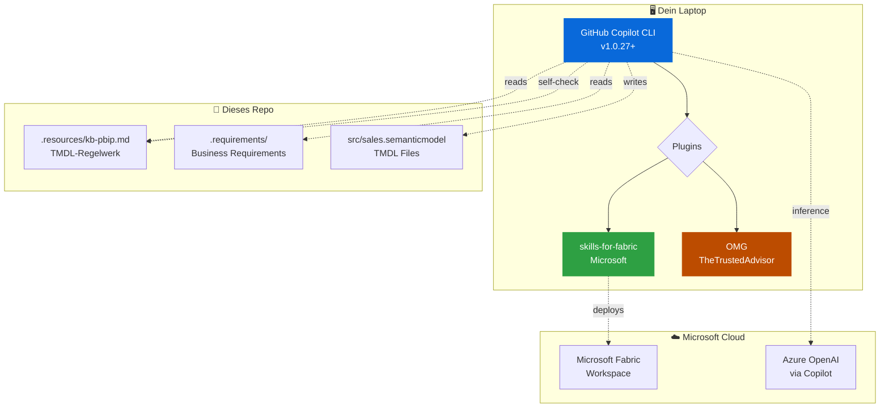
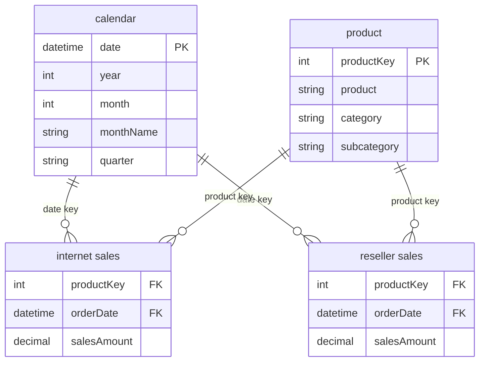
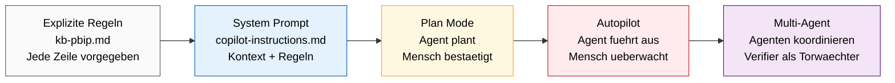

# Global Azure Hamburg 2026 — Agents & Yolo-Mode

> **Vom System Prompt zum autonomen Team.**
> Live-Workshop-Repo für die Session am **17. April 2026** bei Global Azure Hamburg.
>
> **Speaker**: Matthias Falland — Microsoft Data Platform MVP
> **Sprache**: Deutsch · **Level**: 200 · **Dauer**: 45 Min

---

## Worum geht's hier?

Du sitzt in einer Session, in der ein AI-Agent sich **selbst konfiguriert**, dann die Requirements analysiert und schliesslich ein komplettes Power BI Semantic Model baut — im **Yolo-Mode**. Dieses Repo ist die Buehne: Requirements, Knowledge Base und ein leeres Modell warten darauf, vom Agenten gefuellt zu werden.

Das Schluesselmoment: Das Repo hat **kein `.github/copilot-instructions.md`**. Der Agent schreibt sich seine eigenen Regeln, bevor er anfaengt zu arbeiten. Rekursiv. Transparent. Live.

---

## Der rote Faden



Die Skala auf der X-Achse ist **Autonomie**: links eng gefuehrt mit Guardrails, rechts vollstaendiger Autopilot mit paralleler Multi-Agent-Orchestrierung. Jede Station hebt die Vertrauensebene um eine Stufe.

---

## Die 5 Akte

### 🔧 Akt 1 — Der Agent bootstrapt sich selbst (7 Min)


**Prompt zum Kopieren:**

```text
Analysiere dieses Repository — Struktur, Dateien, Zweck. Erstelle dann eine
.github/copilot-instructions.md die beschreibt: was dieses Projekt ist, wie die
Ordnerstruktur aussieht, und welche Regeln ein Agent beim Arbeiten in diesem Repo
befolgen muss. Lies dafuer .resources/kb-pbip.md und .requirements/requirements-01.md.
Schreib alles auf Deutsch.
```

**Wow-Moment**: "Der hat sich gerade selbst konfiguriert?" — Der Agent wird zum Produzenten seines eigenen System-Prompts.

---

### 🔍 Akt 2 — Requirements & Gap-Report (5 Min)

Der Agent vergleicht `.requirements/requirements-01.md` mit dem aktuellen Modell-Zustand (Measures fehlen komplett) und erstellt einen Soll/Ist-Report.

**Prompt:**

```text
Lies die .requirements/requirements-01.md und pruefe den aktuellen Zustand
des Semantic Models unter src/sales.semanticmodel. Erstelle einen
Gap-Report: welche Measures sind gefordert, welche existieren, was fehlt.
```

**Wow-Moment**: "Der weiss was fehlt — ohne dass ich es ihm sage."

---

### 📋 Akt 3 — Plan Mode: SALES-001 (10 Min)

Shift+Tab → **Plan Mode**. Der Agent plant die TMDL-Implementierung fuer `SALES-001` (Total Sales Amount) — *nach den Regeln, die er in Akt 1 selbst geschrieben hat*.

**Prompt** (auch in `prompts/act-3-plan-sales-001.txt`):

```text
Lies zuerst die Knowledge Base in .resources/kb-pbip.md. Dann
implementiere SALES-001: Total Sales Amount. Befolge die TMDL-Regeln
exakt. Alle Beschreibungen auf Deutsch.
```

**Wow-Moment**: "Der befolgt Regeln, die er sich selbst gegeben hat."

---

### 🚀 Akt 4 — Autopilot: alle Requirements (7 Min)

Shift+Tab → **Autopilot Mode** (`--allow-all`). Der Agent implementiert SALES-002 (YoY/MoM Growth) und SALES-003 (Top Products Rank) ohne Rueckfragen.

**Prompt** (auch in `prompts/act-4-autopilot.txt`):

```text
Implementiere alle verbleibenden Requirements aus .requirements/requirements-01.md.
Befolge die TMDL-Regeln aus kb-pbip.md. Alle Beschreibungen auf Deutsch.
Fuehre am Ende einen Self-Check durch: gehe alle Naming-Conventions durch
und dokumentiere die Ergebnisse.
```

**Wow-Moment**: "Das hat gerade 2 Minuten gedauert."

---

### 🤝 Akt 5 — OMG Spezialisten-Triangle (5 Min)

[OMG](https://github.com/TheTrustedAdvisor/omg)s `team 3` delegiert an **drei verschiedene spezialisierte Agents** — nicht drei Klone, sondern drei Experten. Der `document-specialist` dokumentiert einen Fabric-Workspace, der `security-reviewer` prüft dein M365-Profil, der `architect` kritisiert eine Azure-RG. Read-only, zwei Minuten, drei Experten-Reports.

**Prompt** (auch in `prompts/act-5-triangle.txt`):

```text
team 3:
  fabric-documenter: Nutze OMG's document-specialist Agent.
    Enumeriere Fabric-Workspaces via az rest, filter 'mf-*',
    waehle ersten. Erstelle vollstaendige Workspace-Doku.
    Output: docs/fabric-workspace-doc.md.

  m365-security-reviewer: Nutze OMG's security-reviewer Agent.
    Review mein M365-Profil via Graph API (/me, /me/authentication/methods,
    /me/appRoleAssignments). Priorisierte Findings + Empfehlungen.
    Output: docs/m365-security-review.md.

  azure-architect-critic: Nutze OMG's architect Agent. Waehle erste
    rg-* aus 'az group list', kritisiere Architektur mit Severity-Level
    pro Finding. Output: docs/azure-rg-architecture-review.md.
```

**Wow-Moment**: "Drei Experten, drei Clouds, zwei Minuten — und zwar *verschiedene* Experten. Das ist der Wert von OMG."

**Output mit glow anzeigen** (cross-platform):

```bash
glow docs/fabric-workspace-doc.md
glow docs/m365-security-review.md
glow docs/azure-rg-architecture-review.md

# Oder interaktiv paginiert
glow -p docs/fabric-workspace-doc.md
```

**Kein Cleanup noetig** — Akt 5 ist vollstaendig read-only.

---

## Tech-Stack



| Komponente | Was | Link |
|------------|-----|------|
| **GitHub Copilot CLI** | Agent-Host mit Plan/Autopilot-Modi | [copilot-cockpit.com](https://copilot-cockpit.com) — Workflow-Patterns & Tips |
| **Microsoft Skills for Fabric** | Erstklassige Skills fuer Lakehouse, SQL DW, Spark, KQL, Semantic Models | [github.com/microsoft/skills-for-fabric](https://github.com/microsoft/skills-for-fabric) |
| **OMG Plugin** | Multi-Agent-Orchestrierung · 25 Agenten · 43 Skills · echte parallele Subagenten | [github.com/TheTrustedAdvisor/omg](https://github.com/TheTrustedAdvisor/omg) |
| **PBIP / TMDL** | Power BI Project Format & Tabular Model Definition Language | [Projects Overview](https://learn.microsoft.com/en-us/power-bi/developer/projects/projects-overview) · [TMDL Overview](https://learn.microsoft.com/en-us/analysis-services/tmdl/tmdl-overview) |

---

## Das Semantic Model das gebaut wird



**Star Schema** mit zwei Fact-Tables (Internet + Reseller) und zwei geteilten Dimensionen. Der Agent erstellt:

- **SALES-001**: `Total Sales Amount` = `[Internet Sales Amount] + [Reseller Sales Amount]`
- **SALES-002**: `Sales YoY Growth %` via `SAMEPERIODLASTYEAR`, `Sales MoM Growth %` via `PREVIOUSMONTH`
- **SALES-003**: `Product Sales Rank` via `RANKX`

---

## Das Trust-Spectrum



**Kernaussage**: Yolo-Mode ist kein Kontrollverlust, sondern Kontrolle auf einer anderen Ebene. Die Guardrails (Requirements, Knowledge Base, Agent-Self-Check) wurden *vorher* gesetzt — der Agent operiert innerhalb dieses Rahmens.

---

## Try it Yourself

### Prerequisites

### Schneller Weg: setup-Script

Das Repo bringt Setup-Scripts für alle Plattformen mit. Sie prüfen/installieren GitHub CLI, Copilot CLI, Azure CLI und Plugins und stellen den Clean-State her.

**macOS / Linux (Bash):**

```bash
curl -fsSL https://raw.githubusercontent.com/TheTrustedAdvisor/global-azure-2026-agents-yolo/main/setup.sh -o setup.sh
chmod +x setup.sh
./setup.sh           # Installiert + klont nach ~/demo-global-azure-2026
./setup.sh --check   # Verifiziert nur, installiert nichts
./setup.sh --reset   # Zwischen Dry-Runs zum Clean-State
```

**Windows (PowerShell 5.1+ oder PowerShell 7 / pwsh):**

```powershell
iwr https://raw.githubusercontent.com/TheTrustedAdvisor/global-azure-2026-agents-yolo/main/setup.ps1 -OutFile setup.ps1
.\setup.ps1           # Installiert via winget + klont nach $HOME\demo-global-azure-2026
.\setup.ps1 -Check    # Verifiziert nur, installiert nichts
.\setup.ps1 -Reset    # Zwischen Dry-Runs zum Clean-State
```

> **Windows-Note**: Das PS-Script nutzt `winget` für Installationen. Falls winget fehlt: Windows 11 hat es von Haus aus, Windows 10 via Microsoft Store ("App Installer"). Alternativ Git Bash / WSL verwenden und `setup.sh` laufen lassen.

### Manuell

```bash
# GitHub Copilot CLI
npm install -g @github/copilot
gh auth login

# Azure CLI (für Akt 5 — Triangle: Azure Resource Group)
# macOS: brew install azure-cli
# Linux: curl -sL https://aka.ms/InstallAzureCLIDeb | sudo bash
az login

# Repo klonen
git clone https://github.com/TheTrustedAdvisor/global-azure-2026-agents-yolo.git
cd global-azure-2026-agents-yolo

# Plugins installieren
# OMG (aus Shell):
copilot plugin install TheTrustedAdvisor/omg

# Skills for Fabric: NACH Start von `copilot` INTERN in dieser Reihenfolge:
#   1) /plugin marketplace add microsoft/skills-for-fabric
#   2) /plugin install skills-for-fabric@fabric-collection

# Los geht's
copilot
```

### Prompts zum Copy-Paste

Alle 5 Akt-Prompts liegen in `prompts/`:

```bash
# macOS: direkt ins Clipboard
pbcopy < prompts/act-1-bootstrap.txt

# Linux: via xclip
xclip -selection clipboard < prompts/act-1-bootstrap.txt

# Oder einfach lesen und tippen
cat prompts/act-1-bootstrap.txt
```

---

## Troubleshooting

| Problem | Loesung |
|---------|---------|
| `copilot: command not found` | `gh extension install github/gh-copilot` oder Update ueber `gh extension upgrade github/gh-copilot` |
| Agent schreibt falsche Naming-Convention | Das ist Feature, nicht Bug — der Self-Check gegen kb-pbip.md faengt das. Genau darum geht's in der Demo. |
| `.github/copilot-instructions.md` existiert schon | `rm .github/copilot-instructions.md` — der Demo-Clou ist dass er neu geschrieben wird |
| Autopilot-Mode haengt | `Ctrl+C`, dann `copilot --resume` — Copilot CLI merkt sich den State |

---

## Weiterfuehrende Ressourcen

### Copilot CLI & Agent-Workflows
- 🎯 [copilot-cockpit.com](https://copilot-cockpit.com) — Workflow-Patterns, Cheatsheets, Video-Walkthroughs
- 📖 [GitHub Copilot CLI Docs](https://docs.github.com/en/copilot/github-copilot-in-the-cli/about-github-copilot-in-the-cli)
- 🎬 [Agent Mode Launch Blog](https://code.visualstudio.com/blogs/2025/02/24/introducing-copilot-agent-mode)

### Multi-Agent-Orchestrierung
- 🤖 [OMG Plugin](https://github.com/TheTrustedAdvisor/omg) — 25 Agents, 43 Skills, Multi-Model-Routing
- 📘 [OMG Quickstart](https://github.com/TheTrustedAdvisor/omg#quickstart)

### Microsoft Fabric & Power BI
- 🏗️ [Microsoft Skills for Fabric](https://github.com/microsoft/skills-for-fabric)
- 📐 [PBIP File Format](https://learn.microsoft.com/en-us/power-bi/developer/projects/projects-overview)
- 📝 [TMDL Language](https://learn.microsoft.com/en-us/analysis-services/tmdl/tmdl-overview)
- 🔍 [Best Practice Analyzer Rules](https://github.com/microsoft/Analysis-Services/blob/master/BestPracticeRules/BPARules.json)

### Community
- 👥 [Fabric User Group Hamburg](https://www.meetup.com/fabric-user-group-hamburg/)
- 🎥 [Fabric Friday](https://www.youtube.com/@FabricFriday) — woechentliche Deep-Dives

---

## Speaker & Kontakt

**Matthias Falland** — Microsoft Data Platform MVP · Azure Architect

- 💼 [LinkedIn](https://linkedin.com/in/matthias-falland)
- 📺 [Fabric Friday YouTube](https://www.youtube.com/@FabricFriday)

**Fragen nach der Session?** LinkedIn-DM oder direkt vor Ort.

---

## Credits

Dieser Workshop basiert auf dem exzellenten **[pbip-demo-agentic](https://github.com/RuiRomano/pbip-demo-agentic)** von [Rui Romano](https://github.com/RuiRomano). Die Requirements, das TMDL-Regelwerk (`kb-pbip.md`) und die BPA-Validierung stammen aus seinem Original. Die Modifikationen fuer Global Azure Hamburg:

- Measures aus Fact-Tables entfernt (Demo-Startzustand)
- `.github/copilot-instructions.md` entfernt (Agent baut live)
- Copilot-CLI-spezifische Prompts und 5-Akt-Dramaturgie

---

## License

MIT — frei zum Forken, Anpassen, Weiterbenutzen. Siehe [LICENSE](LICENSE).
