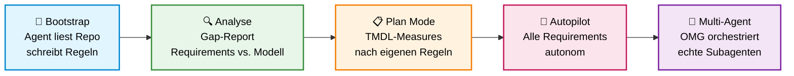
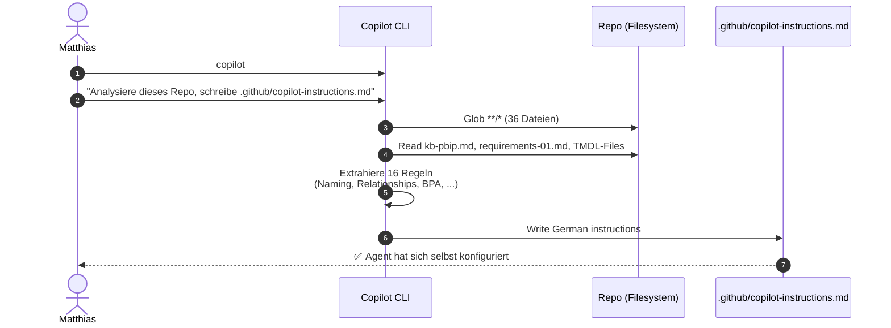
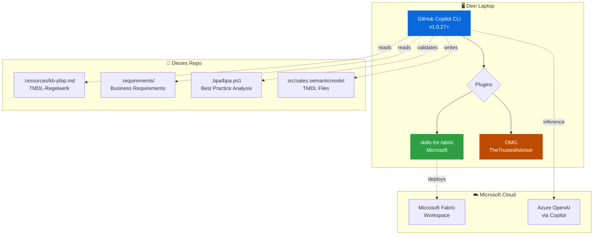
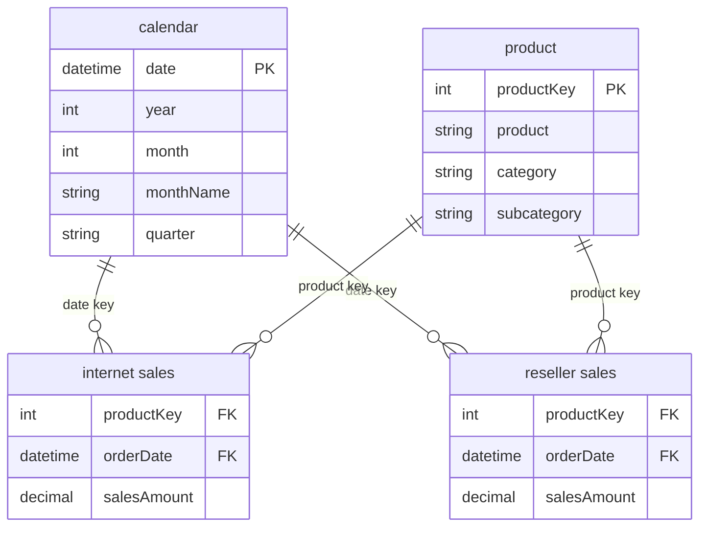
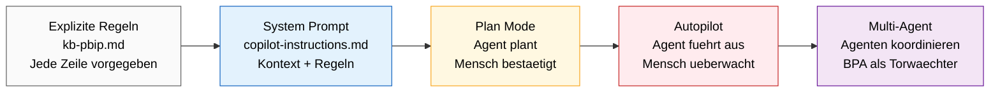

# Global Azure Hamburg 2026 — Agents & Yolo-Mode

> **Vom System Prompt zum autonomen Team.**
> Live-Workshop-Repo für die Session am **17. April 2026** bei Global Azure Hamburg.
>
> **Speaker**: Matthias Falland — Microsoft Data Platform MVP
> **Sprache**: Deutsch · **Level**: 200 · **Dauer**: 45 Min

---

## Worum geht's hier?

Du sitzt in einer Session, in der ein AI-Agent sich **selbst konfiguriert**, dann die Requirements analysiert und schliesslich ein komplettes Power BI Semantic Model baut — im **Yolo-Mode**. Dieses Repo ist die Buehne: Requirements, Knowledge Base und ein leeres Modell warten darauf, vom Agenten gefuellt zu werden.

Das Schluesselmoment: Das Repo hat **kein `.github/copilot-instructions.md`**. Der Agent schreibt sich seine eigenen Regeln, bevor er anfaengt zu arbeiten. Rekursiv. Transparent. Live.

---

## Der rote Faden



Die Skala auf der X-Achse ist **Autonomie**: links eng gefuehrt mit Guardrails, rechts vollstaendiger Autopilot mit paralleler Multi-Agent-Orchestrierung. Jede Station hebt die Vertrauensebene um eine Stufe.

---

## Die 5 Akte

### 🔧 Akt 1 — Der Agent bootstrapt sich selbst (7 Min)



**Prompt zum Kopieren:**

```text
Analysiere dieses Repository — Struktur, Dateien, Zweck. Erstelle dann eine
.github/copilot-instructions.md die beschreibt: was dieses Projekt ist, wie die
Ordnerstruktur aussieht, und welche Regeln ein Agent beim Arbeiten in diesem Repo
befolgen muss. Lies dafuer .resources/kb-pbip.md und .requirements/requirements-01.md.
Schreib alles auf Deutsch.
```

**Wow-Moment**: "Der hat sich gerade selbst konfiguriert?" — Der Agent wird zum Produzenten seines eigenen System-Prompts.

---

### 🔍 Akt 2 — Requirements & Gap-Report (5 Min)

Der Agent vergleicht `.requirements/requirements-01.md` mit dem aktuellen Modell-Zustand (Measures fehlen komplett) und erstellt einen Soll/Ist-Report.

**Prompt:**

```text
Lies die .requirements/requirements-01.md und pruefe den aktuellen Zustand
des Semantic Models unter src/sales.semanticmodel. Erstelle einen
Gap-Report: welche Measures sind gefordert, welche existieren, was fehlt.
```

**Wow-Moment**: "Der weiss was fehlt — ohne dass ich es ihm sage."

---

### 📋 Akt 3 — Plan Mode: SALES-001 (10 Min)

Shift+Tab → **Plan Mode**. Der Agent plant die TMDL-Implementierung fuer `SALES-001` (Total Sales Amount) — *nach den Regeln, die er in Akt 1 selbst geschrieben hat*.

**Prompt:**

```text
Implementiere SALES-001 aus den Requirements. Halte dich strikt an die
Regeln in .github/copilot-instructions.md und .resources/kb-pbip.md.
Validiere am Ende mit .bpa/bpa.ps1.
```

**Wow-Moment**: "Der befolgt Regeln, die er sich selbst gegeben hat."

---

### 🚀 Akt 4 — Autopilot: alle Requirements (7 Min)

Shift+Tab → **Autopilot Mode** (`--allow-all`). Der Agent implementiert SALES-002 (YoY/MoM Growth) und SALES-003 (Top Products Rank) ohne Rueckfragen.

**Prompt:**

```text
Implementiere SALES-002 und SALES-003 aus den Requirements. Alle Measures
in den Fact-Table-Dateien, Beschreibungen auf Deutsch, am Ende BPA laufen lassen.
```

**Wow-Moment**: "Das hat gerade 2 Minuten gedauert."

---

### 🤝 Akt 5 — OMG Multi-Agent (5 Min)

[OMG](https://github.com/TheTrustedAdvisor/omg) orchestriert **echte parallele Subagenten** — kein Schein-Fleet, sondern spawnende Prozesse mit eigenen Rollen.

**Prompt:**

```text
autopilot: Pruefe Semantic Model auf Naming Conventions, korrigiere Verstoesse,
validiere mit BPA, und schreibe einen Change-Report.
```

**Wow-Moment**: "Das sind echte Subagenten, keine Simulation."

---

## Tech-Stack



| Komponente | Was | Link |
|------------|-----|------|
| **GitHub Copilot CLI** | Agent-Host mit Plan/Autopilot-Modi | [copilot-cockpit.com](https://copilot-cockpit.com) — Workflow-Patterns & Tips |
| **Microsoft Skills for Fabric** | Erstklassige Skills fuer Lakehouse, SQL DW, Spark, KQL, Semantic Models | [github.com/microsoft/skills-for-fabric](https://github.com/microsoft/skills-for-fabric) |
| **OMG Plugin** | Multi-Agent-Orchestrierung · 25 Agenten · 43 Skills · echte parallele Subagenten | [github.com/TheTrustedAdvisor/omg](https://github.com/TheTrustedAdvisor/omg) |
| **PBIP / TMDL** | Power BI Project Format & Tabular Model Definition Language | [Projects Overview](https://learn.microsoft.com/en-us/power-bi/developer/projects/projects-overview) · [TMDL Overview](https://learn.microsoft.com/en-us/analysis-services/tmdl/tmdl-overview) |

---

## Das Semantic Model das gebaut wird



**Star Schema** mit zwei Fact-Tables (Internet + Reseller) und zwei geteilten Dimensionen. Der Agent erstellt:

- **SALES-001**: `Total Sales Amount` = `[Internet Sales Amount] + [Reseller Sales Amount]`
- **SALES-002**: `Sales YoY Growth %` via `SAMEPERIODLASTYEAR`, `Sales MoM Growth %` via `PREVIOUSMONTH`
- **SALES-003**: `Product Sales Rank` via `RANKX`

---

## Das Trust-Spectrum



**Kernaussage**: Yolo-Mode ist kein Kontrollverlust, sondern Kontrolle auf einer anderen Ebene. Die Guardrails (Requirements, Knowledge Base, BPA-Validierung) wurden *vorher* gesetzt — der Agent operiert innerhalb dieses Rahmens.

---

## Try it Yourself

### Prerequisites

```bash
# GitHub Copilot CLI
# macOS/Linux
curl -fsSL https://github.com/cli/cli/releases/latest/download/install.sh | sh
gh auth login

# GitHub Copilot Subscription (Pro empfohlen wegen Claude-Modellen)
# → https://github.com/features/copilot

# PowerShell (fuer BPA-Validierung)
# macOS: brew install --cask powershell
# Ubuntu: sudo apt install -y powershell

# Azure CLI (fuer Fabric-Deployment)
# → https://learn.microsoft.com/en-us/cli/azure/install-azure-cli
```

### Repo klonen & starten

```bash
git clone https://github.com/TheTrustedAdvisor/global-azure-2026-agents-yolo.git
cd global-azure-2026-agents-yolo

# Plugins installieren (optional fuer Akte 2 + 5)
copilot plugin install microsoft/skills-for-fabric
copilot plugin install TheTrustedAdvisor/omg

# Los geht's
copilot
```

Dann den Bootstrap-Prompt aus **Akt 1** einwerfen und zuschauen.

### BPA manuell laufen lassen

```bash
pwsh ./.bpa/bpa.ps1 -src src/sales.semanticmodel
```

---

## Troubleshooting

| Problem | Loesung |
|---------|---------|
| `copilot: command not found` | `gh extension install github/gh-copilot` oder Update ueber `gh extension upgrade github/gh-copilot` |
| `pwsh: command not found` | PowerShell Core installieren (siehe Prerequisites) |
| Agent schreibt falsche Naming-Convention | Das ist Feature, nicht Bug — BPA faengt das. Genau darum geht's in der Demo. |
| `.github/copilot-instructions.md` existiert schon | `rm .github/copilot-instructions.md` — der Demo-Clou ist dass er neu geschrieben wird |
| Autopilot-Mode haengt | `Ctrl+C`, dann `copilot --resume` — Copilot CLI merkt sich den State |

---

## Weiterfuehrende Ressourcen

### Copilot CLI & Agent-Workflows
- 🎯 [copilot-cockpit.com](https://copilot-cockpit.com) — Workflow-Patterns, Cheatsheets, Video-Walkthroughs
- 📖 [GitHub Copilot CLI Docs](https://docs.github.com/en/copilot/github-copilot-in-the-cli/about-github-copilot-in-the-cli)
- 🎬 [Agent Mode Launch Blog](https://code.visualstudio.com/blogs/2025/02/24/introducing-copilot-agent-mode)

### Multi-Agent-Orchestrierung
- 🤖 [OMG Plugin](https://github.com/TheTrustedAdvisor/omg) — 25 Agents, 43 Skills, Multi-Model-Routing
- 📘 [OMG Quickstart](https://github.com/TheTrustedAdvisor/omg#quickstart)

### Microsoft Fabric & Power BI
- 🏗️ [Microsoft Skills for Fabric](https://github.com/microsoft/skills-for-fabric)
- 📐 [PBIP File Format](https://learn.microsoft.com/en-us/power-bi/developer/projects/projects-overview)
- 📝 [TMDL Language](https://learn.microsoft.com/en-us/analysis-services/tmdl/tmdl-overview)
- 🔍 [Best Practice Analyzer Rules](https://github.com/microsoft/Analysis-Services/blob/master/BestPracticeRules/BPARules.json)

### Community
- 👥 [Fabric User Group Hamburg](https://www.meetup.com/fabric-user-group-hamburg/)
- 🎥 [Fabric Friday](https://www.youtube.com/@FabricFriday) — woechentliche Deep-Dives

---

## Speaker & Kontakt

**Matthias Falland** — Microsoft Data Platform MVP · Azure Architect

- 💼 [LinkedIn](https://linkedin.com/in/matthias-falland)
- 📺 [Fabric Friday YouTube](https://www.youtube.com/@FabricFriday)

**Fragen nach der Session?** LinkedIn-DM oder direkt vor Ort.

---

## Credits

Dieser Workshop basiert auf dem exzellenten **[pbip-demo-agentic](https://github.com/RuiRomano/pbip-demo-agentic)** von [Rui Romano](https://github.com/RuiRomano). Die Requirements, das TMDL-Regelwerk (`kb-pbip.md`) und die BPA-Validierung stammen aus seinem Original. Die Modifikationen fuer Global Azure Hamburg:

- Measures aus Fact-Tables entfernt (Demo-Startzustand)
- `.github/copilot-instructions.md` entfernt (Agent baut live)
- Copilot-CLI-spezifische Prompts und 5-Akt-Dramaturgie

---

## License

MIT — frei zum Forken, Anpassen, Weiterbenutzen. Siehe [LICENSE](LICENSE).
